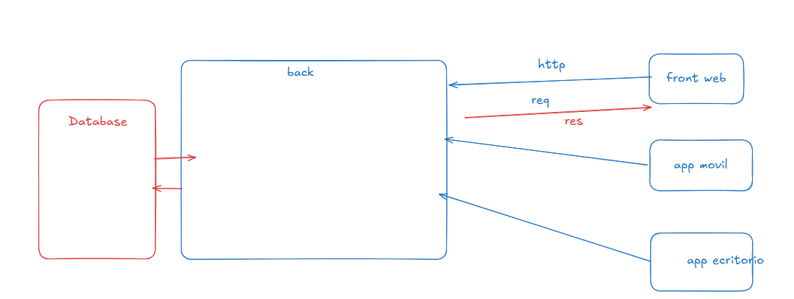

# Arquitectura cliente-servidor

## Introduccion
La arquitectura cliente-servidor describe como dos partes del sistema cooperan.
El cliente solicita un servicio.
El servidor procesa la solicitud y responde.
Esta separacion permite escalar y organizar el trabajo.
Tambien facilita que varios clientes usen el mismo servidor.

## Analogia del restaurante
Imagina un restaurante con cocina y comensales.
Los comensales son los clientes.
La cocina es el backend.
El mesero representa el canal de comunicacion.
El menu es la lista de endpoints disponibles.
Cada platillo equivale a un recurso o accion.
El pedido es la solicitud.
La entrega es la respuesta.
La caja es parte de la logica del negocio.
El inventario representa los datos.

## Que resuelve esta arquitectura
Permite que el cliente no conozca detalles internos.
Evita que el cliente toque la base de datos directamente.
Mejora la seguridad y el control de acceso.
Facilita la reutilizacion del servidor con varios clientes.
Permite cambiar el frontend sin reescribir el backend.

## Componentes principales
Cliente web en el navegador.
App movil en iOS o Android.
App de escritorio en Windows o Mac.
Servidor que expone una API.
Base de datos para almacenar informacion.
Middleware para seguridad y validacion.

## Req y res en terminos simples
`req` incluye todo lo que el cliente envia.
Incluye headers, parametros y cuerpo.
`res` es lo que el servidor devuelve.
Incluye codigo de estado y datos.
El codigo de estado indica si todo salio bien.

## Importancia de HTTP
HTTP es un protocolo estandar.
Define metodos como GET, POST, PUT, DELETE.
Define codigos como 200, 400, 401, 404, 500.
Define headers para autenticacion y tipo de contenido.
Permite interoperabilidad entre distintos clientes.

## Separacion de responsabilidades
El cliente se enfoca en experiencia de usuario.
El servidor se enfoca en reglas de negocio.
La base de datos se enfoca en persistencia.
Cada parte puede evolucionar sin romper a las otras.

## Seguridad
El servidor controla acceso a recursos.
El servidor valida y limpia entradas.
El servidor aplica autenticacion y autorizacion.
El cliente no ve secretos ni credenciales.

## Consistencia y control
La logica del negocio vive en un solo lugar.
Se evita duplicar reglas en varios clientes.
Se mantiene un comportamiento uniforme.

## Ventajas principales
Reutilizacion del backend.
Mantenimiento mas simple.
Mejor control de datos.
Facilidad para auditar.
Posibilidad de monitoreo centralizado.

## Limitaciones y desafios
Dependencia de la red.
Necesidad de manejar latencia.
Versionado de API cuando evoluciona.
Manejo de errores en el cliente.
Diseño de endpoints claros.

## Relacion con MVC y Clean Architecture
La capa de controladores vive en el servidor.
Las rutas exponen los endpoints.
Los modelos representan los datos.
Los servicios contienen reglas de negocio.
El cliente consume solo la API.

## Buenas practicas
Definir endpoints consistentes.
Documentar la API.
Validar datos en el servidor.
Manejar errores con respuestas claras.
Proteger rutas sensibles.
Medir rendimiento con logs y metricas.
